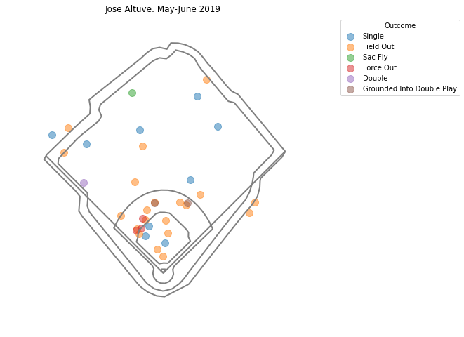
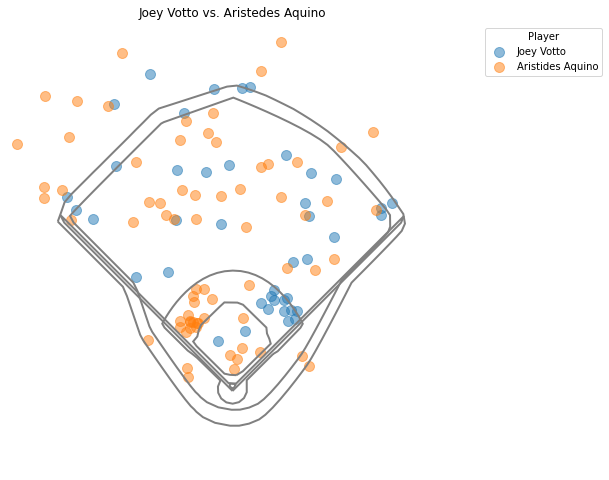

# Plotting

`plot_stadium(team)`

Plot the outline of a specified team's stadium using MLBAM coordinates

## Arguments

`team`: name of the team whose stadium you're plotting. Acceptable inputs:
* `angels`
* `astros`
* `athletics`
* `blue_jays`
* `braves`
* `brewers`
* `cardinals`
* `cubs`
* `diamondbacks`
* `dodgers`
* `generic`
* `giants`
* `indians`
* `mariners`
* `marlins`
* `mets`
* `nationals`
* `orioles`
* `padres`
* `phillies`
* `pirates`
* `rangers`
* `rays`
* `red_sox`
* `reds`
* `rockies`
* `royals`
* `tigers`
* `twins`
* `white_sox`
* `yankees`

---

`spraychart(data, team_stadium, title='', tooltips=[], size=100, colorby='events', legend_title='', width=500, height=500)`

## Arguments

`data`: Statcast data containing at the minimum `hc_x`, `hc_y`, and `events`. Any additional data you want included in the tooltips needs to also be included

`team_stadium`: name of the team whose stadium you want the hits overlaid on. Acceptable inputs are the same as above

`title`: title for your chart

`size`: size of the marks on the spraychart

`colorby`: which category in the data to use when color-coding the marks. By default will use the `events` variable. If there are multiple players in your data, use `player` to give each player their own unique color.

`legend_title`: optional arugment to change the title of the legend

`width`: width of the plot

`height`: height of the plot

# Example

```python
from pybaseball import statcast_batter, spraychart


data = statcast_batter('2019-05-01', '2019-07-01', 514888)
sub_data = data[data['home_team'] == 'HOU']
spraychart(sub_data, 'astros', title='Jose Altuve: May-June 2019')
```


```python
votto_data = statcast_batter('2019-08-01', '2019-10-01', 458015)
aquino_data = statcast_batter('2019-08-01', '2019-10-01', 606157)
data = pd.concat([votto_data, aquino_data])
home_data = data[data['home_team'] == 'CIN']
spraychart(home_data, 'reds', title='Joey Votto vs. Aristedes Aquino', colorby='player')
```


---

`plot_bb_profile(df: pd.DataFrame, parameter: Optional[str] = "launch_angle")`

Plots a given StatCast parameter split by bb type.

## Arguments
df (pd.DataFrame): StatCast pd.DataFrame (retrieved through statcast, statcast_batter, etc)

parameter (Optional[str], optional): Parameter to plot. Defaults to "launch_angle".

## Example

```
from pybaseball.plotting import plot_bb_profile
from pybaseball import statcast
import matplotlib.pyplot as plt

df = statcast("2018-05-01","2018-05-04")
plot_bb_profile(df, parameter="launch_angle")
plt.show()
```


