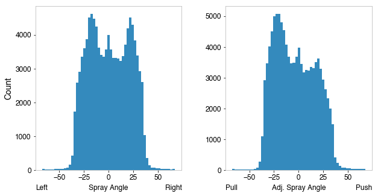

# Statcast Utils

Utility functions for additional calculations on StatCast DataFrames. Located in `pybaseball/datahelpers/statcast_utils.py

## Functions

`add_spray_angle(df: pd.DataFrame,  adjusted: Optional[bool] = False)`

Adds spray angle and adjusted spray angle to StatCast DataFrames
    - Spray angle is the raw left-right angle of the hit 
    - Adjusted spray angle flips the sign for left handed batters, making it a push/pull angle. Inspired by [this Alan Nathan post](http://baseball.physics.illinois.edu/carry-v2.pdf).
The formula to transform hit coordinates to spray angle used was obtained from [this blog post](https://baseballwithr.wordpress.com/2018/01/15/chance-of-hit-as-function-of-launch-angle-exit-velocity-and-spray-angle/).


### Arguments

df (pd.DataFrame): StatCast pd.DataFrame (retrieved through statcast, statcast_batter, etc)

### Example

The following code:

```
from pybaseball.datahelpers.statcast_utils import add_spray_angle
from pybaseball import statcast

df = statcast("2018-05-01","2018-05-02")
# get hits
df = df[~df["bb_type"].isna()]
# Add Spray angle
df = add_spray_angle(df)
print("Spray Angle:")
print(df["spray_angle"][0:5])
df = add_spray_angle(df, adjusted=True)
print("Adjusted Spray Angle:")
print(df["adj_spray_angle"][0:5])
```

Will yield these calculated spray angles:

```
Spray Angle:
255    35.923343
300     3.571058
632    25.055293
698    -1.642098
732     2.711636
Name: spray_angle, dtype: float64
Adjusted Spray Angle:
255   -35.923343
300     3.571058
632    25.055293
698     1.642098
732     2.711636
Name: adj_spray_angle, dtype: float64
```

Notice the first (return index 255) and fourth (index 698) are from left-handed batters, since the sign on their spray angle is opposite that of their adjusted spray angle.

### Sample distributions

Shown for 2018 data:



